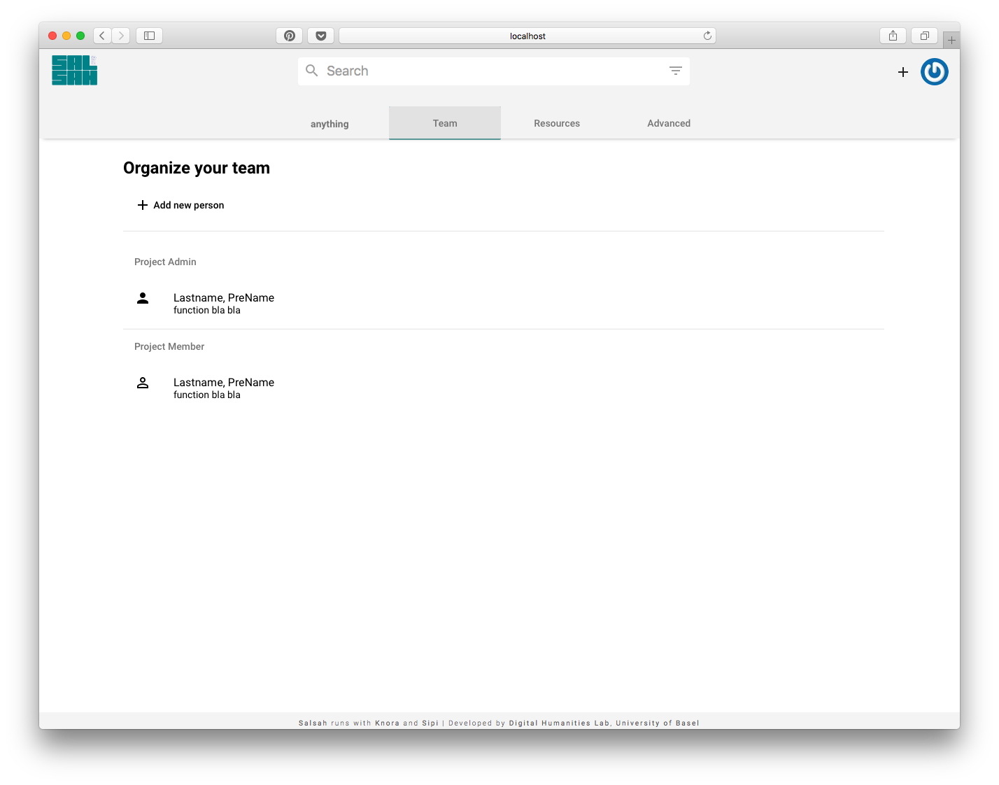
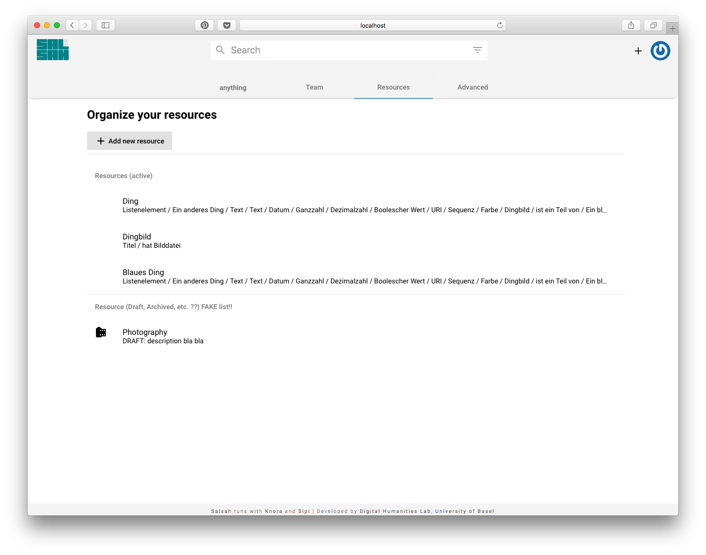

..  Copyright © 2016 Lukas Rosenthaler, André Kilchenmann, Andreas Aeschlimann,
    Sofia Georgakopoulou, Ivan Subotic, Benjamin Geer, Tobias Schweizer.
    This file is part of SALSAH.
    SALSAH is free software: you can redistribute it and/or modify
    it under the terms of the GNU Affero General Public License as published
    by the Free Software Foundation, either version 3 of the License, or
    (at your option) any later version.
    SALSAH is distributed in the hope that it will be useful,
    but WITHOUT ANY WARRANTY; without even the implied warranty of
    MERCHANTABILITY or FITNESS FOR A PARTICULAR PURPOSE.
    You should have received a copy of the GNU Affero General Public
    License along with SALSAH.  If not, see <http://www.gnu.org/licenses/>.

.. Index for genindex.html
.. index::
    project
    admin
    ontology editor

.. Links
.. _resource-class: ../../modules/form/index.html#resource-class-form

.. _project:

Project dashboard
=================
The project dashboard component is to setup and edit a project. It's similar to Salsah v1's admin interface. But now specific for each project.

The project has a header with a tab bar to navigate through the following sub components:

Profile / Settings
------------------
The first tab contains the project dashboard: an overview of recent activities, a description etc.

Team
----
This component shows a list of project members. A project admin can edit or add new members or groups to this project.

Resources / Ontology Editor
---------------------------
This component shows a list of resource classes (ontologies), which are used in the project. A project admin can edit or add new ontologies. Here, one of the form component (app/view/modules/form/ resource-class_ ) will be used.

The third tab contains the resource class and ontology editor.

