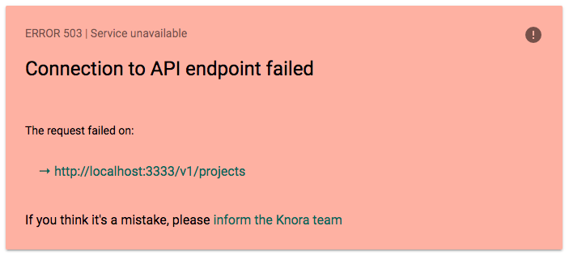
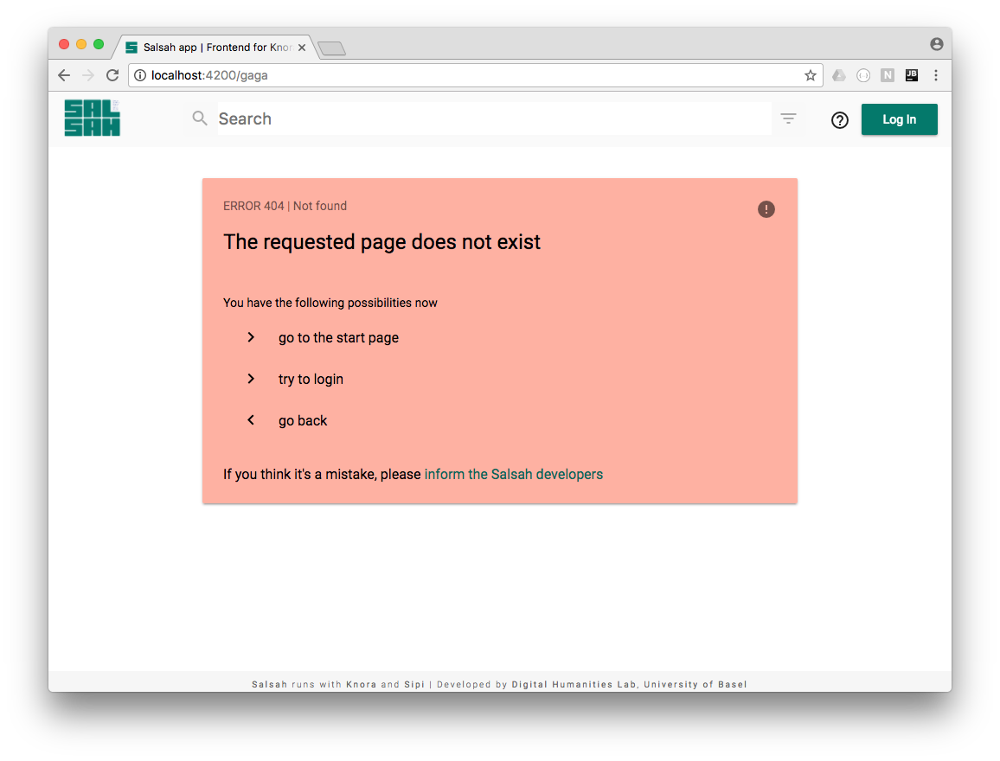

..  Copyright © 2016 Lukas Rosenthaler, André Kilchenmann, Andreas Aeschlimann,
    Sofia Georgakopoulou, Ivan Subotic, Benjamin Geer, Tobias Schweizer.
    This file is part of SALSAH.
    SALSAH is free software: you can redistribute it and/or modify
    it under the terms of the GNU Affero General Public License as published
    by the Free Software Foundation, either version 3 of the License, or
    (at your option) any later version.
    SALSAH is distributed in the hope that it will be useful,
    but WITHOUT ANY WARRANTY; without even the implied warranty of
    MERCHANTABILITY or FITNESS FOR A PARTICULAR PURPOSE.
    You should have received a copy of the GNU Affero General Public
    License along with SALSAH.  If not, see <http://www.gnu.org/licenses/>.

.. Index for genindex.html
.. index::
    error,
    note,
    warning,
    message

.. _403: https://en.wikipedia.org/wiki/HTTP_403
.. _404: https://en.wikipedia.org/wiki/HTTP_404

.. _message:

Message
=======
The salsah-message component can be used for error and warning messages, but also for notes and (developer) hints.
It's a simple card with different background color and content defined in the attribute [note] or [error].

To show an api error, you can use it as following:

    ``<salsah-message *ngIf="errorMessage" [error]="errorMessage"></salsah-message>``

We're using the same component for 404 page errors in the app routing module directly. In the case of route, we have to add the attribute data here. In this we only set the (http) status code:

    ``component: MessageComponent, data: {code: '404'}``

The implemented (http) status codes are:

400, 401, 403_, 404_, 418, 500, 503

