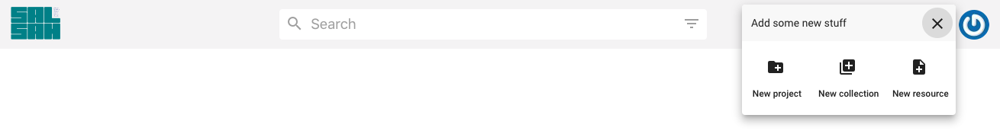

..  Copyright © 2016 Lukas Rosenthaler, André Kilchenmann, Andreas Aeschlimann,
    Sofia Georgakopoulou, Ivan Subotic, Benjamin Geer, Tobias Schweizer.
    This file is part of SALSAH.
    SALSAH is free software: you can redistribute it and/or modify
    it under the terms of the GNU Affero General Public License as published
    by the Free Software Foundation, either version 3 of the License, or
    (at your option) any later version.
    SALSAH is distributed in the hope that it will be useful,
    but WITHOUT ANY WARRANTY; without even the implied warranty of
    MERCHANTABILITY or FITNESS FOR A PARTICULAR PURPOSE.
    You should have received a copy of the GNU Affero General Public
    License along with SALSAH.  If not, see <http://www.gnu.org/licenses/>.

.. _header:

Header
------

The header component is a module of the main salsah framework. It should almost always be visible and it includes important submodules like the search panel (incl. extended search), the user menu button and the "add" button to create new projects, collections or resource instances.

.. figure:: salsah-header.png

A first idea was also to have a project selection menu somewhere in the header panel.

.. figure:: salsah-menu-projects.png
    :scale: 75 %

At the moment, the user gets a list of projects, where he's a member of, from the user menu:

User menu
^^^^^^^^^
When the user is logged in, he can navigate to a list of his projects, collections and to a profile settings page. He can open the documentation, get support or send issues to the developer team (just as an idea).

.. figure:: salsah-menu-user.png

The "add" menu
^^^^^^^^^^^^^^
This is one important menu to add new resource instances, to create a new project or collection. The collection is a new element/object in Salsah 2. The user should be able to save and to organize single resources in collection boxes.

Search panel
^^^^^^^^^^^^

The search panel in the header is an integration of the search module including simple and extended search. The details about the search module are described here: :ref:`search`.

